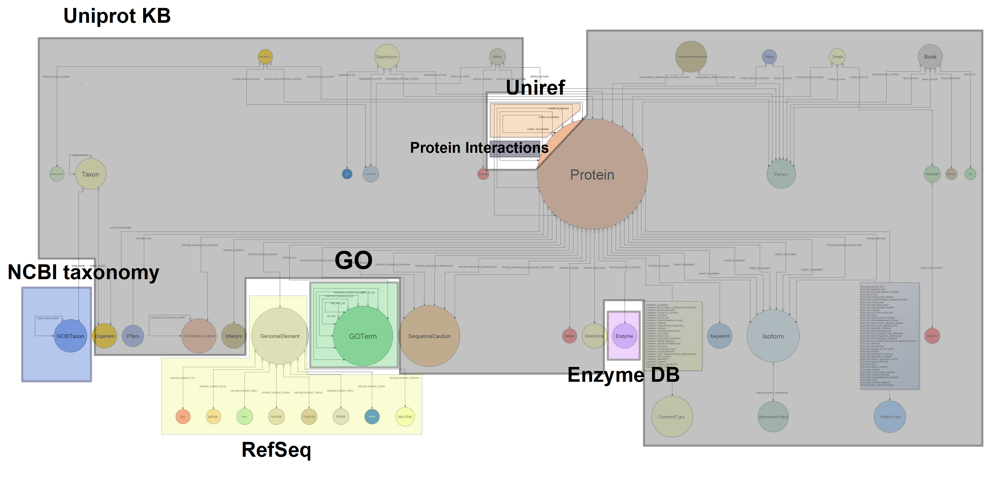
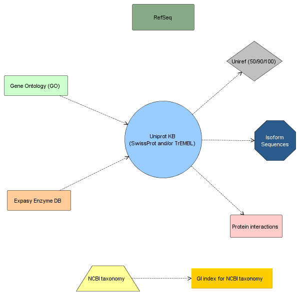

## Bio4j modules

Bio4j importing process is modular and customizable, allowing you to import just the data you are interested in. Here’s the big picture of where do entities and relationships come from in the general domain model:



There’s however one thing that you have to keep in mind, you must be coherent when choosing the data sources you want to have included in your database. There are some modules that need others to be present in the database before importing them. For that I created this simple schema showing the dependencies among the current modules:



OK, so let's have a deeper look at each of the modules.

## Gene Ontology (GO)

Quoting Wikipedia: _"The Gene Ontology project provides an ontology of defined terms representing gene product properties."_ 
GO consists of three independent sub-ontologies:

* **cellular component** _the parts of a cell or its extracellular environment_
* **molecular function** _the elemental activities of a gene product at the molecular level, such as binding or catalysis_
* **biological process** _operations or sets of molecular events with a defined beginning and end, pertinent to the functioning of integrated living units: cells, tissues, organs, and organisms_

This module includes the whole DAG with relationships such as _IS_A_GO_, _HAS_PART_, _NEGATIVELY_REGULATES_, etc...
As you can see in the dependencies schema, you could import the Gene Ontology module alone without any problem. In order to do so just use an _executionsBio4j.xml_ file that should look something like this:

```xml
<scheduled_executions>    
    <execution>
        <class_full_name>com.era7.bioinfo.bio4j.neo4j.programs.ImportGeneOntology</class_full_name>
        <arguments>
            <argument>go.xml</argument>
            <argument>bio4jdb</argument><!--Database folder-->
            <argument>batchInserter.properties</argument><!--Batch inserter properties file-->
        </arguments>
    </execution>    
</scheduled_executions>  
```

## ExPASy Enzyme DB

Quoting their website: _"ENZYME is a repository of information relative to the nomenclature of enzymes. It is primarily based on the recommendations of the Nomenclature Committee of the International Union of Biochemistry and Molecular Biology (IUBMB) and it describes each type of characterized enzyme for which an EC (Enzyme Commission) number has been provided."_
You can check more information about this database here: http://enzyme.expasy.org/

Properties such as:

* ID
* Official name
* Alternate names
* Cofactors
* Comments
* Catalytic activity
* Prosite cross-references

are included in the Enzyme nodes as well as the associations to proteins if there is any.
Data is imported from the file **`enzyme.dat`** which is located here: 

- ftp://ftp.expasy.org/databases/enzyme/enzyme.dat

You can use this _executionsBio4j.xml_ file to import Enzyme DB:

```xml
<scheduled_executions>    
    <execution>
        <class_full_name>com.era7.bioinfo.bio4j.neo4j.programs.ImportEnzymeDB</class_full_name>
        <arguments>
            <argument>enzyme.dat</argument>
            <argument>bio4jdb</argument><!--Database folder-->
            <argument>batchInserter.properties</argument><!--Batch inserter properties file-->
        </arguments>
    </execution>    
</scheduled_executions>  
```

## RefSeq

Quoting their website: _"The Reference Sequence (RefSeq) collection aims to provide a comprehensive, integrated, non-redundant, well-annotated set of sequences, including genomic DNA, transcripts, and proteins."_

Bio4j incorporates the data available in **RefSeq Complete release** _(gbff imported files can be found here: ftp://ftp.ncbi.nlm.nih.gov/refseq/release/complete/ )_.

Nodes created from this data source include, among others: Genome element, gene, CDS, RNA...
> Just note that whenever there's redundant information about proteins/genes that's also present in UniProt KB we always give preference to that found in UniProt.

The respective _executionsBio4j.xml_ would look something like this:

```xml
<scheduled_executions>    
    <execution>
		<class_full_name>com.era7.bioinfo.bio4j.neo4j.programs.ImportRefSeq</class_full_name>
		<arguments>
			<argument>refseq_data</argument><!-- Folder including all .gbff files -->
			<argument>bio4jdb</argument><!--Database folder-->
			<argument>batchInserter.properties</argument><!--Batch inserter properties file-->
		</arguments>
	</execution>  
</scheduled_executions>  
```

## UniRef

_"The UniProt Reference Clusters (UniRef) consist of three databases of clustered sets of protein sequences from UniProtKB and selected UniParc records. The UniRef100 database combines identical sequences and sequence fragments (from any organism) into a single UniRef entry. UniRef100 sequences are clustered using the CD-HIT algorithm to build UniRef90 and UniRef50. Each cluster is composed of sequences that have at least 90% or 50% sequence identity, respectively, to the longest sequence."_

You can find here: ftp://ftp.uniprot.org/pub/databases/uniprot/uniref/ the respective compressed XML files that we use in order to import UniRef data.

> Just note that UniParc clusters are not imported into Bio4j.

Use this _executionsBio4j.xml_ file in order to import UniRef clusters:

```xml
<scheduled_executions>    
    <execution>
	<class_full_name>com.era7.bioinfo.bio4j.neo4j.programs.ImportUniref</class_full_name>
		<arguments>
			<argument>uniref100.xml</argument><!--UniRef 100 XML file-->
			<argument>uniref90.xml</argument><!--UniRef 90 XML file-->
			<argument>uniref50.xml</argument><!--UniRef 50 XML file-->
			<argument>bio4jdb</argument><!--Database folder-->
			<argument>batchInserter.properties</argument><!--Batch inserter properties file-->
		</arguments>
	</execution>    
</scheduled_executions>  
```

## NCBI taxonomy tree

Bio4j includes the whole NCBI taxonomy tree. 
Files used in the importing process can be found here: ftp://ftp.ncbi.nih.gov/pub/taxonomy/taxdump.tar.gz

Once that information is extracted we are building the tree from the information included in the following files:

* **nodes.dmp**
* **names.dmp**

_**merged.dmp**_ file is also used in order to index taxonomic units by their old IDs.

Besides, taxonomic units can also be indexed by GIs (Gene Identifiers). For that we use the association file that can be found here:

ftp://ftp.ncbi.nih.gov/pub/taxonomy/gi_taxid_nucl.dmp.gz

Use this _executionsBio4j.xml_ file to import the tree:

```xml
<scheduled_executions>    
    	<execution>
		<class_full_name>com.era7.bioinfo.bio4j.neo4j.programs.ImportNCBITaxonomy</class_full_name>
		<arguments>
			<argument>nodes.dmp</argument>
			<argument>names.dmp</argument>
			<argument>merged.dmp</argument>
			<argument>bio4jdb</argument><!--Database folder-->
			<argument>true</argument><!-- Associate UniProt taxonomy -->
		</arguments>
	</execution>
</scheduled_executions>  
```

In the case where you also want to index taxonomic units by the respective GIs, you should also run this other program:

```xml
<scheduled_executions>    
    <execution>
		<class_full_name>com.era7.bioinfo.bio4j.neo4j.programs.IndexNCBITaxonomyByGiId</class_full_name>
		<arguments>
			<argument>gi_taxid_nucl.dmp</argument><!-- GI - tax_id association file -->
			<argument>bio4jdb</argument><!-- Database folder -->
			<argument>batchInserter.properties</argument> <!-- Batch inserter properties file -->		
		</arguments>
	</execution>   
</scheduled_executions>  
```

## UniProt KB

_"The UniProt Knowledgebase (UniProtKB) is the central hub for the collection of functional information on proteins, with accurate, consistent and rich annotation."_
Bio4j includes both:

*  **Swiss-Prot**: _reviewed, manually annotated_
*  **TrEMBL**: _unreviewed, automatically annotated_

Almost all data included in UniProt KB has been incorporated into Bio4j, only some external references (or similar things) are still to be included.
If you want to include both datasets (Swiss-Prot and TrEMBL) use a executions.XML file looking like this:

```xml
<scheduled_executions>    
	<execution>
		<class_full_name>com.era7.bioinfo.bio4j.neo4j.programs.ImportUniProt</class_full_name>
		<arguments>
			<argument>uniprot_sprot.xml</argument>
			<argument>bio4jdb</argument><!-- Database folder -->
			<argument>batchInserter.properties</argument><!--Batch inserter properties file-->
			<argument>uniprotData.xml</argument><!--XML file used to customize the amount of data imported-->
		</arguments>
	</execution>	
	<execution>
		<class_full_name>com.era7.bioinfo.bio4j.neo4j.programs.ImportUniProt</class_full_name>
		<arguments>
			<argument>uniprot_trembl.xml</argument>
			<argument>bio4jdb</argument><!-- Database folder -->
			<argument>batchInserter.properties</argument><!--Batch inserter properties file-->
			<argument>uniprotData.xml</argument><!--XML file used to customize the amount of data imported-->
		</arguments>
	</execution>   
</scheduled_executions>  
```

If you also want to include protein interactions found in both datasets (Swiss-Prot and TrEMBL) use an extra executions.XML file looking like this:

```xml
<scheduled_executions>    
	<execution>
		<class_full_name>com.era7.bioinfo.bio4j.neo4j.programs.ImportProteinInteractions</class_full_name>
		<arguments>
			<argument>uniprot_sprot.xml</argument>
			<argument>bio4jdb</argument><!-- Database folder -->
			<argument>batchInserter.properties</argument><!--Batch inserter properties file-->
		</arguments>
	</execution>
	<execution>
		<class_full_name>com.era7.bioinfo.bio4j.neo4j.programs.ImportProteinInteractions</class_full_name>
		<arguments>
			<argument>uniprot_trembl.xml</argument>
			<argument>bio4jdb</argument><!-- Database folder -->
			<argument>batchInserter.properties</argument><!--Batch inserter properties file-->
		</arguments>
	</execution>
</scheduled_executions>  
```

In order to import Isoform sequences and names you would also need an extra executions.xml file looking like this:

```xml
<scheduled_executions>    
	<execution>
		<class_full_name>com.era7.bioinfo.bio4j.neo4j.programs.ImportIsoformSequences</class_full_name>
		<arguments>
			<argument>uniprot_sprot_varsplic.fasta</argument>
			<argument>bio4jdb</argument><!-- Database folder -->
		</arguments>
	</execution>
</scheduled_executions>  
```
